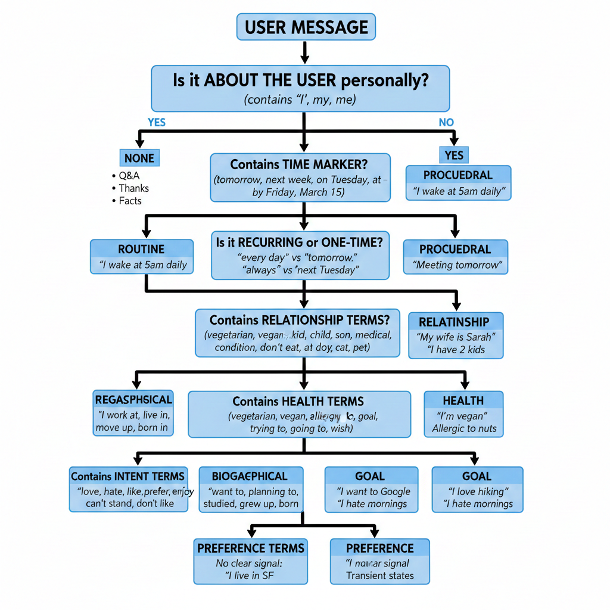

# Memory Garden 🌱

An AI chat application with **intelligent memory capabilities** that remembers user preferences, goals, health info, biographical facts, routines, and relationships — with explicit user consent and conflict detection.

**Live URL**: https://memorygardenn.lovable.app

**Presentation URL**: https://www.popai.pro/ppt-share?shareKey=65ce2049a70ea2af33ccd085b037585c4023ad352049c8d62ff0f344a3853396&utm_source=presentationsharepage

---

## 🧠 How It Works

Memory Garden is a chat application where the AI assistant can **learn and remember things about you** across conversations. Every user message is analyzed to detect memorable information, which is then classified, verified, and stored — either globally (persists forever) or per-thread (session-only).

### Core Flow

```
┌──────────────────────────────────────────────────────────────────────────────┐
│                         USER SENDS A MESSAGE                                  │
└──────────────────────────────────────────────────────────────────────────────┘
                                    │
                                    ▼
┌──────────────────────────────────────────────────────────────────────────────┐
│  1️⃣ CLASSIFY (preference-classifier)                                         │
│     • Determines if message contains memorable info                           │
│     • Assigns memory_type: preference | goal | health | biographical_fact     │
│       | routine | procedural_memory | relationship | ephemeral | irrelevant   │
│     • Decides scope: is_global_candidate (true/false)                         │
│     • Generates short_summary + confidence score                              │
└──────────────────────────────────────────────────────────────────────────────┘
                                    │
                    ┌───────────────┴───────────────┐
                    │                               │
            is_global_candidate?            NOT global candidate
                    │                               │
                    ▼                               ▼
┌────────────────────────────────┐   ┌─────────────────────────────────┐
│  2️⃣ VERIFY (memory-verifier)   │   │  Store as SESSION memory         │
│  • Validates classification     │   │  (only visible in this thread)   │
│  • Adjusts type/summary if      │   └─────────────────────────────────┘
│    needed                       │
│  • Detects CONFLICTS with       │
│    existing memories            │
└────────────────────────────────┘
                    │
                    ▼
┌──────────────────────────────────────────────────────────────────────────────┐
│  3️⃣ STORE as GLOBAL memory (persists across all threads)                     │
│     • Shows toast notification with option to edit/delete                     │
│     • Displays conflict warnings if detected                                  │
└──────────────────────────────────────────────────────────────────────────────┘
                                    │
                                    ▼
┌──────────────────────────────────────────────────────────────────────────────┐
│  4️⃣ RESPOND (chat function)                                                  │
│     • Injects ALL relevant memories into system prompt                        │
│     • AI responds with full context of who you are                            │
│     • Memories treated as "ground truth" for personalization                  │
└──────────────────────────────────────────────────────────────────────────────┘
```

---

## 🧬 Long-Term Data Classifier (Decision Tree)

The classification logic follows this decision tree to determine memory type:




## 📁 Project Structure

```
memorygardenn/
├── src/
│   ├── pages/
│   │   ├── Index.tsx          # Main chat interface + memory management
│   │   ├── Auth.tsx           # Authentication page
│   │   └── NotFound.tsx       # 404 page
│   ├── components/
│   │   ├── MemoryFlashcards.tsx   # UI to view/edit/delete memories
│   │   ├── ThreadSidebar.tsx      # Sidebar showing all conversation threads
│   │   └── ui/                    # shadcn-ui components
│   ├── hooks/
│   │   └── use-toast.ts       # Toast notifications
│   └── integrations/
│       └── supabase/
│           ├── client.ts      # Supabase client setup
│           └── types.ts       # Database type definitions
├── supabase/
│   ├── functions/
│   │   ├── preference-classifier/  # LLM-based memory classification
│   │   ├── memory-verifier/        # LLM-based verification + conflict detection
│   │   └── chat/                   # Main chat endpoint with memory injection
│   └── migrations/            # Database schema migrations
└── package.json
```

---

## 🔧 Backend Functions (Supabase Edge Functions)

### 1. `preference-classifier` — Memory Classification

**Location**: `supabase/functions/preference-classifier/index.ts`

**Purpose**: Analyzes user messages and classifies them into structured memory types.

**LLM Used**: `google/gemini-2.5-flash-lite`

**Input**:
```json
{ "message": "I'm allergic to peanuts and I wake up at 6am every day" }
```

**Output**:
```json
{
  "memory_type": "health",
  "is_global_candidate": true,
  "short_summary": "User is allergic to peanuts",
  "reason": "Health-related allergy information should be remembered globally for safety",
  "confidence": 0.95
}
```

**Memory Types**:
| Type | Description | Example |
|------|-------------|---------|
| `preference` | Likes/dislikes, style choices | "I prefer dark mode" |
| `goal` | Objectives, aspirations, tasks | "I want to learn Spanish" |
| `health` | Medical info, allergies, wellness | "I'm allergic to peanuts" |
| `biographical_fact` | Stable personal info | "I live in NYC", "I'm a software engineer" |
| `routine` | Habits, regular activities | "I wake up at 6am" |
| `procedural_memory` | How-to knowledge, learned skills | "I organize files by date" |
| `relationship` | Info about other people | "My sister is Sarah" |
| `ephemeral` | Temporary info (not stored) | "It's raining today" |
| `irrelevant` | Not worth remembering | "Hello", "Thanks" |

---

### 2. `memory-verifier` — Verification & Conflict Detection

**Location**: `supabase/functions/memory-verifier/index.ts`

**Purpose**: Validates classified memories and detects conflicts with existing memories.

**LLM Used**: `google/gemini-2.5-flash`

**Input**:
```json
{
  "memory_type": "preference",
  "short_summary": "User prefers light mode",
  "existing_memories": [
    { "memory_type": "preference", "short_summary": "User prefers dark mode" }
  ]
}
```

**Output**:
```json
{
  "verified": true,
  "adjusted_memory_type": "preference",
  "adjusted_summary": "User prefers light mode",
  "verification_explanation": "Valid preference, but conflicts with existing dark mode preference",
  "conflicts_detected": ["Conflicts with preference about dark mode"]
}
```

---

### 3. `chat` — AI Response with Memory Context

**Location**: `supabase/functions/chat/index.ts`

**Purpose**: Generates AI responses with full memory context injected.

**LLM Used**: `google/gemini-2.5-flash`

**How memories are used**:
```typescript
// System prompt injection
const memoryContext = `
You have access to the following structured user memories.
Treat them as ground truth about the user's preferences, routines, 
relationships and facts.

USER MEMORIES:
Global memories:
- [preference] (0.95) User prefers dark mode
- [health] (0.92) User is allergic to peanuts
- [routine] (0.88) User wakes up at 6am

Thread-specific memories:
- [goal] (0.90) User is planning a trip to Japan
`;
```

---

## 🗄️ Database Schema (Supabase PostgreSQL)

### Tables

#### `sessions` — Conversation Threads
```sql
id: uuid (PK)
user_id: uuid (FK → auth.users)
title: text | null          -- First user message becomes title
created_at: timestamptz
last_active_at: timestamptz
```

#### `messages` — Chat History
```sql
id: uuid (PK)
user_id: uuid
session_id: uuid (FK → sessions)
role: 'user' | 'assistant'
content: text
created_at: timestamptz
```

#### `memories` — Stored Memories
```sql
id: uuid (PK)
user_id: uuid
session_id: uuid (FK → sessions)
memory_type: enum('preference', 'goal', 'health', 'biographical_fact', 
                   'routine', 'procedural_memory', 'relationship')
scope: enum('global', 'session')
content: text               -- Original user message
short_summary: text         -- Normalized memory summary
confidence: number | null
verified: boolean
verification_prompt: text | null
verification_response: text | null
superseded_by: uuid | null  -- For conflict resolution
expires_at: timestamptz | null
created_at: timestamptz
updated_at: timestamptz
```

#### `memory_conflicts` — Conflict Tracking
```sql
id: uuid (PK)
memory_a_id: uuid (FK → memories)
memory_b_id: uuid (FK → memories)
conflict_type: text
resolution_strategy: text | null
resolved: boolean
resolved_at: timestamptz | null
created_at: timestamptz
```

---

## 🎨 Frontend Features

### 1. Chat Interface with Memory Classification Hover

When you hover over a user message, a tooltip shows:
- **Memory type** (preference, goal, health, etc.)
- **Scope** (global or session)
- **Summary** of what was remembered
- **Confidence score**
- **Verification result** (if verified)
- **Conflicts detected** (if any)

### 2. Thread Sidebar

- Shows all conversation threads
- Displays thread title (first user message)
- Shows last active time
- Click to switch threads
- Delete threads (also deletes associated session memories)

### 3. Memory Flashcards Dialog

Access via the **"Memories"** button in the header:
- View all **Global memories** (persist forever)
- View all **Thread memories** (current session only)
- **Edit** memory summaries
- **Delete** memories
- **Add** new memories manually

### 4. Toast Notifications

- **Memory saved**: Shows when a memory is stored
- **Conflict warning**: Shows when new memory conflicts with existing
- **"Edit or delete"** action: Opens memory flashcards dialog

---

## 🚀 Getting Started

### Prerequisites
- Node.js 18+
- Supabase account
- Lovable API key (for AI gateway)

### Local Development

```sh
# Install dependencies
npm install

# Start development server
npm run dev
```

### Deploy Supabase Functions

```sh
# Link to your Supabase project
supabase link --project-ref YOUR_PROJECT_REF

# Deploy all edge functions
supabase functions deploy preference-classifier
supabase functions deploy memory-verifier
supabase functions deploy chat

# Set secrets
supabase secrets set LOVABLE_API_KEY=your_key_here
```

---

## 🛠️ Tech Stack

| Layer | Technology |
|-------|------------|
| Frontend | React 18, TypeScript, Vite |
| Styling | Tailwind CSS, shadcn-ui |
| Backend | Supabase Edge Functions (Deno) |
| Database | Supabase PostgreSQL |
| Auth | Supabase Auth |
| LLM | Google Gemini 2.5 Flash (via Lovable AI Gateway) |

---

## 📊 LLM Call Flow Per Message

| Step | LLM Call? | Model | Purpose |
|------|-----------|-------|---------|
| 1. Classify | ✅ Yes | gemini-2.5-flash-lite | Determine memory type |
| 2. Verify | ✅ Yes (if global) | gemini-2.5-flash | Validate + conflict check |
| 3. Respond | ✅ Yes | gemini-2.5-flash | Generate AI response |

**Total LLM calls per message**: 2-3 depending on classification result

---

## 🤖 Custom Fine-Tuned Model (Alternative)

For production deployment with reduced latency and cost, a **custom fine-tuned 3B parameter model** is available as an alternative to the Gemini API calls.

### Model Details

| Property | Value |
|----------|-------|
| **Base Model** | 3B parameter LLM |
| **Training Data** | 8,000 labeled examples |
| **Task** | Memory classification |

### Training Data Categories

The model was fine-tuned on 8,000 examples covering all memory classification types:

| Category | Description |
|----------|-------------|
| `preference` | User likes, dislikes, style choices |
| `goal` | Objectives, aspirations, future plans |
| `health` | Medical info, allergies, wellness data |
| `biographical_fact` | Personal info (name, location, job, etc.) |
| `routine` | Daily habits, regular activities |
| `procedural_memory` | How-to knowledge, learned processes |
| `relationship` | Info about people in user's life |
| `ephemeral` | Temporary, time-bound information |

### Benefits of Fine-Tuned Model

- **Lower latency**: Single local inference vs. API round-trip
- **Cost reduction**: No per-token API costs
- **Offline capable**: Can run without internet connection
- **Customized**: Trained specifically for memory classification task

### Integration

The fine-tuned model can replace the `preference-classifier` edge function for memory type classification, reducing the LLM call flow to:

| Step | Model | Purpose |
|------|-------|---------|
| 1. Classify | **Fine-tuned 3B** | Determine memory type (local) |
| 2. Verify | gemini-2.5-flash | Validate + conflict check(only when new preference is added and biweekly once) |
| 3. Respond | gemini-2.5-flash | Generate AI response |

This reduces API costs by ~33% while maintaining classification accuracy.

---

## 💰 Cost Analysis: Fine-Tuned Model vs API

### Current API Pricing (Gemini Flash)

| Metric | Value |
|--------|-------|
| Cost per 1M tokens | ~$0.30 |
| Avg tokens per classification | ~200-300 tokens |
| Classifications per $1 | ~3,500-5,000 |

### Fine-Tuned 3B Model Hosting Costs

| Provider | Cost/hour | Cost/month (24/7) |
|----------|-----------|-------------------|
| AWS g4dn.xlarge (T4 GPU) | ~$0.50/hr | ~$365/month |
| RunPod (RTX 3090) | ~$0.40/hr | ~$290/month |
| Modal (serverless) | ~$0.0003/sec | Pay per inference |
| Hugging Face Inference | ~$0.06/hr | ~$45/month (shared) |

### Break-Even Analysis

```
Monthly API cost = (messages/month × tokens/message × $0.30) / 1,000,000

Break-even point for dedicated GPU (~$300/month):
$300 = (X × 250 × $0.30) / 1,000,000
X = 4,000,000 messages/month
  = ~133,000 messages/day
  = ~5,500 messages/hour
```

### Recommendation

| Scale | Recommendation | Reason |
|-------|----------------|--------|
| **< 100K msg/month** | ✅ Use API | API is 10x cheaper |
| **100K - 1M msg/month** | ⚖️ Consider hybrid | Serverless fine-tuned for peaks |
| **> 4M msg/month** | ✅ Self-host fine-tuned | Dedicated GPU pays off |

### Why Fine-Tuning Still Makes Sense

Even if hosting costs are similar, fine-tuning provides:

1. **Latency**: 50-100ms local vs 200-500ms API roundtrip
2. **Reliability**: No rate limits, no API outages
3. **Privacy**: User data never leaves your infrastructure
4. **Customization**: Model trained on YOUR exact classification logic
5. **Offline**: Works without internet (edge deployment)


